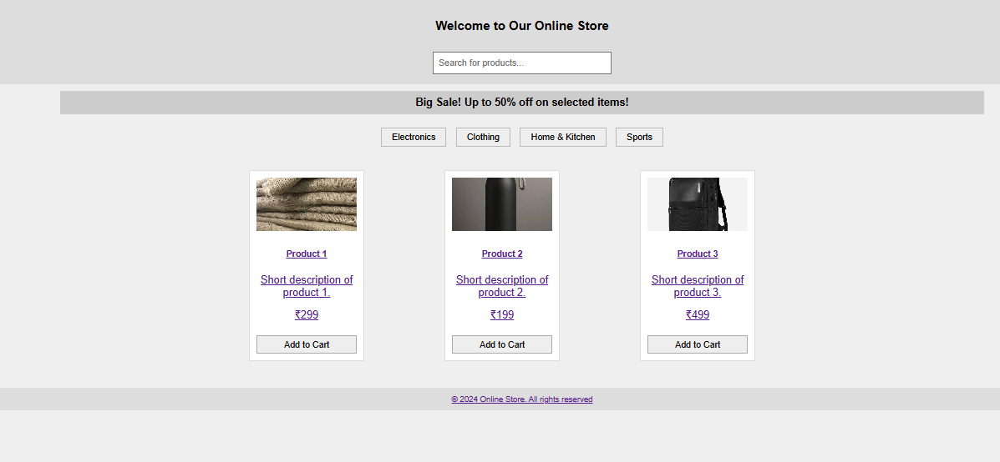
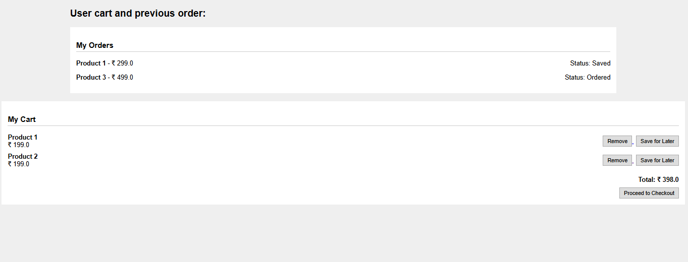
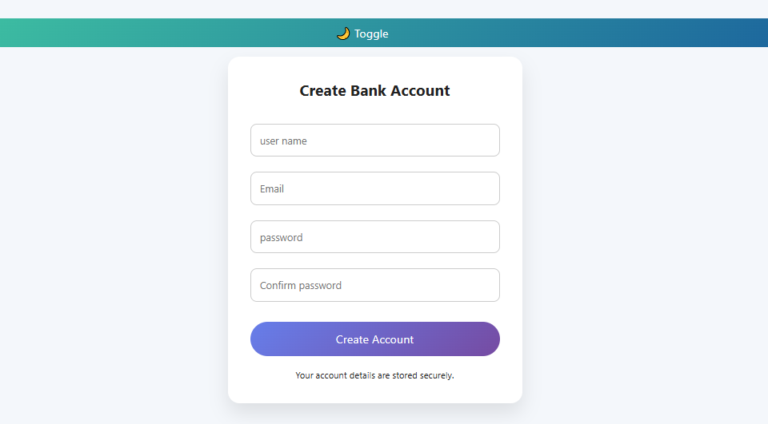
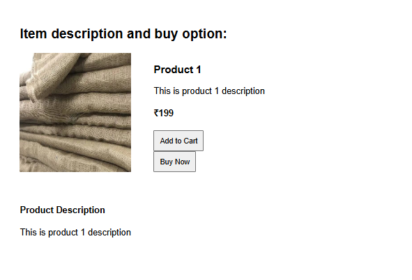

# 🛒 Online Store Project

## 📌 Description
This is a simple online store web application built using Spring Boot and Thymeleaf.

## 🚀 Features
- View products
- Add to cart
- Buy now option
- User login & account creation

## 🛠 Tech Stack
- Java (Spring Boot)
- Thymeleaf
- HTML, CSS
## 📸 Screenshots

### 🏠 Dashboard

### 🔐 Login Page

### 🛒 Cart Page

### 👤 Account Page

### 📦 Product Details

## ▶️ How to Run
1. Clone the repository
2. Open in Spring Tool Suite / Eclipse
3. Run the application
4. Open browser: http://localhost:8080

## 📂 Project Structure
- Controller → Handles requests
- Entity → Database models
- Repository → Database operations
- Templates → HTML pages
- Static → Images, CSS

## 👤 Author
Naeem
